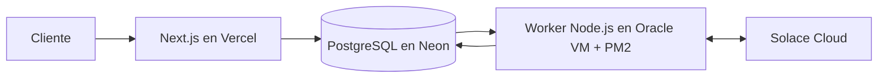
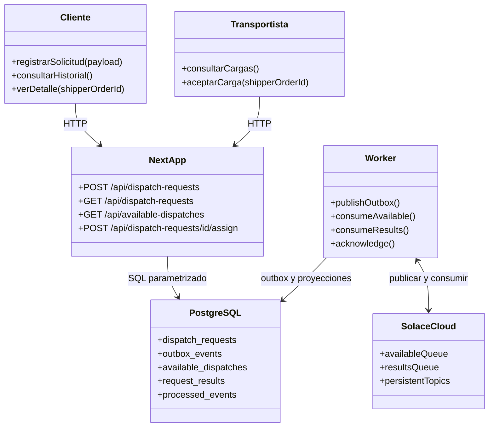
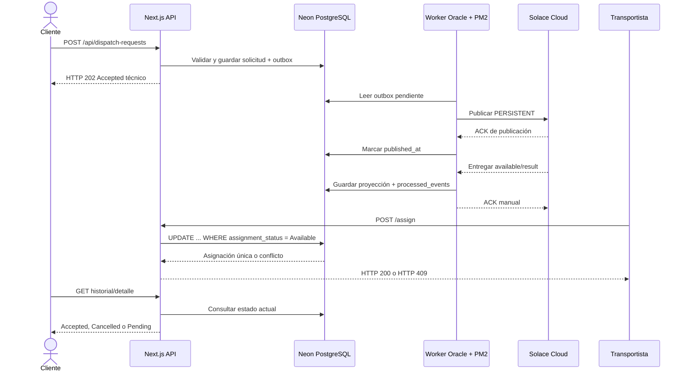
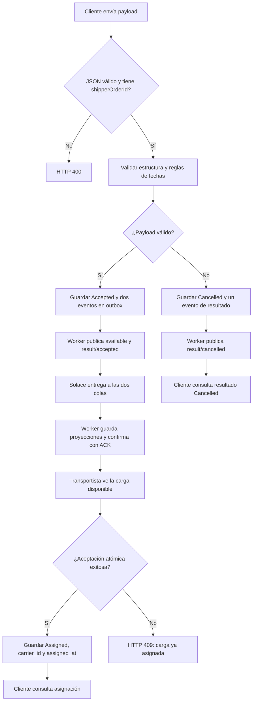

# Global Dispatch

Demo de gestión de cargas para NewCron. Recibe solicitudes, valida fechas de negocio, publica eventos persistentes en Solace Cloud y mantiene vistas para clientes y transportistas.

## Arquitectura desplegada



- **Frontend y API:** Next.js 16, TypeScript, Tailwind CSS 4 y lucide-react en Vercel.
- **Base de datos:** PostgreSQL en Neon mediante `pg`.
- **Mensajería:** Solace Cloud mediante `solclientjs` sobre WSS.
- **Worker:** Node.js en una VM Oracle Cloud Always Free, administrado con PM2.
- **Gestor de paquetes:** pnpm 10.19.0.

## Casos de uso

| Actor | Caso de uso | Resultado |
| --- | --- | --- |
| Cliente | Registrar una solicitud de carga | La solicitud queda validada y encolada para procesamiento. |
| Cliente | Consultar historial y detalle | Ve fechas, resultado, motivo y asignación. |
| Transportista | Consultar cargas disponibles | Ve únicamente cargas válidas procesadas por el worker. |
| Transportista | Aceptar una carga | La carga se asigna una sola vez mediante una actualización atómica. |
| Worker | Publicar eventos pendientes | Envía la outbox a los tópicos persistentes de Solace. |
| Worker | Consumir resultados y cargas | Guarda proyecciones y confirma mensajes con ACK manual. |
| Operador | Reiniciar o actualizar el worker | PM2 conserva el proceso y permite revisar sus logs. |

### Diagrama UML de componentes



### Diagrama UML de interacción



### Diagrama de flujo de una solicitud



## Flujo principal

1. El cliente envía una solicitud desde `/solicitudes/nueva`.
2. `POST /api/dispatch-requests` valida y guarda la solicitud junto con eventos en `outbox_events`.
3. El worker publica los eventos pendientes en Solace con modo `PERSISTENT`.
4. El worker consume ambas colas con ACK manual y deduplicación por `eventId`.
5. Las proyecciones se guardan en `available_dispatches` y `request_results`.
6. `/clientes` muestra el historial y `/transportistas` muestra las cargas disponibles.
7. La aceptación utiliza una actualización atómica; una segunda aceptación recibe HTTP 409.

Una solicitud válida publica:

```text
newcron/dispatch/v1/available/{shipperOrderId}
newcron/dispatch/v1/result/accepted/{shipperOrderId}
```

Una solicitud inválida identificable publica únicamente:

```text
newcron/dispatch/v1/result/cancelled/{shipperOrderId}
```

## Contrato de la solicitud

El payload de entrada conserva la estructura definida por el ejercicio:

```json
{
  "shipperOrderId": "6600111",
  "pickupDate": "2026-09-24",
  "deliveryDate": "2026-09-25",
  "price": 900,
  "stops": [
    { "stopNumber": 1, "city": "Milford", "state": "MA", "postalCode": "01757" },
    { "stopNumber": 2, "city": "Shippensburg", "state": "PA", "postalCode": "17257" }
  ],
  "vehicles": [
    { "year": "2010", "make": "Toyota", "model": "Corolla" }
  ],
  "transportationReleaseNotes": "Verify the pickup date."
}
```

Reglas aplicadas en `America/New_York`:

- `pickupDate` no puede ser anterior al día actual.
- Si pickup es hoy, una solicitud recibida después de las 3:00 p.m. se cancela.
- Una solicitud recibida exactamente a las 3:00 p.m. todavía es válida.
- `deliveryDate` debe ser al menos un día calendario posterior a pickup.
- Las fechas se comparan como fechas de negocio, sin convertirlas implícitamente a UTC.
- Un payload ilegible o sin `shipperOrderId` devuelve HTTP 400.
- Un payload inválido con `shipperOrderId` identificable se guarda como `Cancelled`.

Resultados de negocio:

```json
{
  "shipperOrderId": "6600111",
  "status": "Accepted",
  "notes": "You will receive an email when a carrier accepts this dispatch request"
}
```

```json
{
  "shipperOrderId": "7743789",
  "status": "Cancelled",
  "notes": "Pickup date cannot be earlier than the current date."
}
```

## Requisitos

- Node.js LTS compatible con Next.js y `solclientjs`.
- pnpm 10.19.0.
- PostgreSQL en Neon.
- Event Broker Service y credenciales de mensajería en Solace Cloud.

## Instalación local

```bash
git clone <url-del-repositorio>
cd SolaceProject
pnpm install --frozen-lockfile
cp .env.example .env
```

En PowerShell:

```powershell
Copy-Item .env.example .env
```

No subas `.env`, `.env.local`, claves privadas, respaldos de base de datos ni `vm.json`.

## Variables de entorno

La aplicación web necesita:

```dotenv
DATABASE_URL=postgresql://...
BUSINESS_TIME_ZONE=America/New_York
```

El worker necesita además:

```dotenv
SOLACE_URL=wss://...
SOLACE_VPN=...
SOLACE_USERNAME=...
SOLACE_PASSWORD=...
SOLACE_QUEUE_AVAILABLE=newcron.global-dispatch.available.v1
SOLACE_QUEUE_RESULTS=newcron.global-dispatch.results.v1
SOLACE_TOPIC_PREFIX=newcron/dispatch/v1
```

`DATABASE_MIGRATION_URL` se reserva para migraciones controladas y `DATABASE_POOL_MAX` es opcional. No uses `NEXT_PUBLIC_` para secretos.

## Base de datos

```bash
pnpm run db:init
```

Las migraciones se registran en `schema_migrations`. Tablas principales:

- `dispatch_requests`: solicitudes originales y validación.
- `available_dispatches`: cargas disponibles para transportistas.
- `request_results`: resultados `Accepted` o `Cancelled`.
- `outbox_events`: eventos pendientes de publicación.
- `processed_events`: deduplicación por consumidor.

## Desarrollo y verificaciones

```bash
pnpm dev
pnpm run lint
pnpm run typecheck
pnpm run test
pnpm run build
```

Smoke de Solace:

```bash
pnpm run solace:smoke
```

Worker local:

```bash
pnpm run worker:dev
```

Smoke de extremo a extremo (web y worker activos):

```bash
pnpm run dispatch:smoke
```

El script usa `APP_URL` o `http://localhost:3000`:

```powershell
$env:APP_URL = "https://tu-dominio.vercel.app"
pnpm run dispatch:smoke
```

Comprueba aceptación, cancelación, duplicados, conflictos, outbox y proyecciones PostgreSQL.

## API

| Método | Endpoint | Propósito |
| --- | --- | --- |
| `POST` | `/api/dispatch-requests` | Validar y registrar una solicitud. |
| `GET` | `/api/dispatch-requests` | Listar historial. |
| `GET` | `/api/dispatch-requests/{id}` | Consultar detalle y asignación. |
| `GET` | `/api/available-dispatches` | Listar cargas disponibles. |
| `POST` | `/api/dispatch-requests/{id}/assign` | Aceptar atómicamente una carga. |

HTTP 202 indica que la solicitud quedó registrada para procesamiento técnico; no significa que un transportista ya la haya asignado.

## Solace Cloud

Configura dos colas durables con ingreso y consumo habilitados:

| Cola | Suscripciones |
| --- | --- |
| `newcron.global-dispatch.available.v1` | `newcron/dispatch/v1/available/*` |
| `newcron.global-dispatch.results.v1` | `newcron/dispatch/v1/result/accepted/*` y `newcron/dispatch/v1/result/cancelled/*` |

El usuario de mensajería necesita publicar en el prefijo de tópicos y consumir ambas colas. El último segmento del tópico es `shipperOrderId`.

## Worker en Oracle VM

Desde el repositorio clonado en la VM:

```bash
pnpm install --frozen-lockfile
pnpm run db:init
pm2 start pnpm --name global-dispatch-worker -- run worker:start
pm2 save
pm2 startup
```

Ejecuta el comando `sudo` que muestra `pm2 startup` y después:

```bash
pm2 save
```

Operación:

```bash
pm2 status
pm2 logs global-dispatch-worker
pm2 restart global-dispatch-worker --update-env
pm2 stop global-dispatch-worker
```

Actualización desde GitHub:

```bash
cd ~/SolaceProject/SolaceProject
git pull origin develop
pnpm install --frozen-lockfile
pm2 restart global-dispatch-worker --update-env
```

El worker no necesita un puerto HTTP público; solo conexiones salientes hacia Neon y Solace.

## Vercel

Configura en Vercel las variables de la aplicación web:

```text
DATABASE_URL
BUSINESS_TIME_ZONE
```

Las variables `SOLACE_*` pertenecen únicamente al worker de Oracle. Separa Preview y Production para evitar que pruebas escriban en la base de demostración.

## Solución de problemas

### El worker no conecta a Solace

Verifica URL WSS, Message VPN, usuario y contraseña de mensajería. No uses credenciales del portal. Revisa permisos de las colas.

### La solicitud queda en `Pending`

```bash
pm2 status
pm2 logs global-dispatch-worker
```

Después consulta `outbox_events`; si `published_at` es `NULL`, el broker aún no confirmó la publicación.

### No aparece una carga en transportistas

Comprueba que la solicitud sea `Accepted`, que exista en `available_dispatches` y que `assignment_status` sea `Available`.

### Error de conexión a Neon

Usa la cadena pooled en `DATABASE_URL`, conserva TLS y confirma que Vercel y Oracle apunten a la misma base.

## Limitaciones de la demo

- El transportista usa la identidad ficticia `demo-carrier-1`; aún no hay autenticación real.
- Los paneles usan polling cada 2 segundos; SSE queda como mejora posterior.
- La interfaz principal usa dos paradas y un vehículo.
- Los mensajes ilegibles se registran y se confirman para evitar ciclos infinitos; producción debería usar una cola de mensajes muertos.
- Esta demo debe ejecutarse con una sola instancia del worker.

## Estructura relevante

```text
src/app/                 páginas, componentes y Route Handlers
src/domain/              esquemas, reglas y eventos
src/server/db/            pool y migraciones
src/server/repositories/ consultas y proyecciones
src/server/solace/       conexión y colas
src/worker/              outbox y consumidores
migrations/              migraciones PostgreSQL
scripts/                 inicialización y smoke tests
tests/                   pruebas de negocio
```

## Seguridad

- No guardar secretos en Git.
- Rotar credenciales si se exponen.
- Mantener separados los usuarios administrativos y de mensajería.
- No exponer conexiones PostgreSQL o Solace al navegador.

## Entrega

- Repositorio: [github.com/GlendyT/SolaceProject](https://github.com/GlendyT/SolaceProject)
- Aplicación desplegada: publicar la URL actual de Vercel junto con el enlace del repositorio al entregar.
- La entrega debe incluir este `README.md`, el código fuente y las instrucciones de ejecución. No incluye credenciales ni archivos `.env`.
