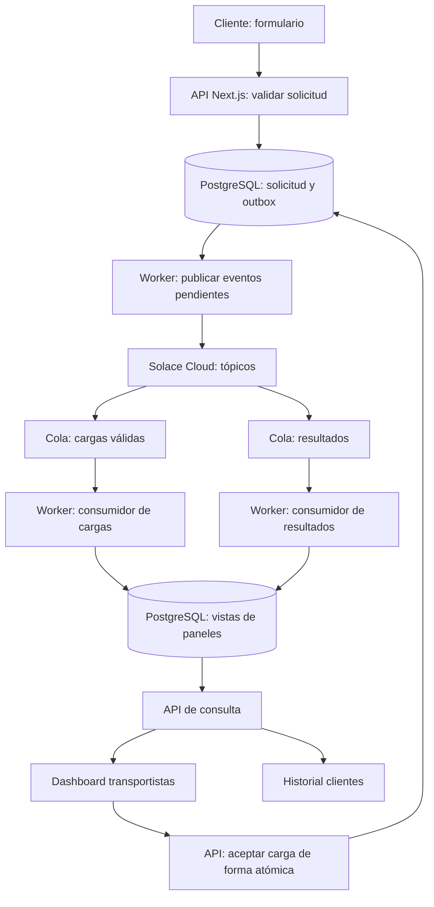

# Plan de implementación — Global Dispatch / NewCron

Fecha de elaboración: 21 de septiembre de 2026.

Documento base: `instrucciones.md`, revisado completo. Este archivo es un plan; todavía no se ha creado la aplicación ni configurado la cuenta de Solace.

Entrega indicada: domingo 27 de septiembre a las 23:55. Se interpreta el año como 2026 por las fechas del ejercicio; la zona horaria de entrega debe confirmarse con quien evalúa.

## 1. Objetivo y alcance

Construir una aplicación con **Next.js, TypeScript, Tailwind CSS y lucide-react** que permita registrar solicitudes de transporte de automóviles, validar sus fechas, distribuir cargas válidas mediante Solace y consultar resultados en dos paneles.

| Requisito del enunciado | Implementación propuesta |
| --- | --- |
| Recibir el payload de una solicitud | Formulario y endpoint HTTP que acepten los campos originales |
| Validar pickup y delivery | Función de dominio en servidor con reloj y zona horaria explícitos |
| Enviar únicamente solicitudes válidas a una cola | Tópico de cargas disponibles con una cola durable suscrita |
| Mostrar pedidos a transportistas | Consumidor de esa cola, PostgreSQL en Neon y dashboard |
| Permitir que un transportista acepte una carga | Acción HTTP con asignación atómica |
| Otra cola con todos los resultados | Tópicos de resultado Accepted/Cancelled y una segunda cola durable |
| Apartado de clientes | Historial alimentado por el consumidor de resultados |
| Cambios en tiempo real | Actualización automática de paneles, inicialmente mediante consulta periódica |
| Entrega por GitHub con README | Repositorio reproducible, documentación y evidencias |

### Alcance mínimo

- Crear solicitudes desde un formulario y cargar un JSON de ejemplo.
- Mostrar resultados `Accepted` y `Cancelled`, incluyendo el motivo.
- Mostrar cargas disponibles y permitir su aceptación por un transportista de demostración.
- Utilizar realmente las dos colas de Solace Cloud.
- Conservar datos tras actualizar la página o reiniciar los procesos.
- Desplegar la solución completa: Next.js y API en Vercel, PostgreSQL en Neon, worker en Render y broker en la cuenta Solace Cloud existente.
- Procesar solicitudes con la computadora local apagada; el entorno local se utiliza únicamente para desarrollo.

### Extras posteriores al flujo completo

- SSE para actualización inmediata, cuentas de usuario completas y correo real. El despliegue de la demo forma parte del alcance acordado.
- Mapas, pagos, rutas, seguimiento GPS y gestión completa de conductores quedan fuera del ejercicio.
- La nota que promete un correo se conserva exactamente en el resultado solicitado. El envío real de correo se considera extensión: no se proporciona dirección de correo ni se exige una integración de email. En la demo, indicar que la notificación está simulada.

## 2. Decisiones de negocio

1. **`Accepted` significa aprobado por el sistema**, no asignado a un conductor. Guardar por separado `validationStatus: Accepted | Cancelled` y `assignmentStatus: Available | Assigned`; una solicitud cancelada no tiene estado de asignación.
2. El límite de las 15:00 aplica al **pickup del mismo día**. El texto libre de `transportationReleaseNotes` menciona entregas, pero la regla explícita del enunciado tiene prioridad y las notas no se ejecutan como reglas.
3. Usar `BUSINESS_TIME_ZONE=America/New_York` como supuesto inicial, ya que el ejemplo opera entre Massachusetts y Pennsylvania. Mostrarlo en la interfaz. No utilizar implícitamente la zona de México, del navegador o del servidor. Si se amplía a todo Estados Unidos, definir la zona por lugar de recogida.
4. Capturar `receivedAt` una sola vez cuando el servidor recibe la solicitud; esa marca determina la validación aunque el procesamiento se retrase.
5. Interpretar “después de las 3 pm” literalmente: 15:00:00 es válido y cualquier instante posterior es inválido para pickup de hoy. Documentar este límite y probarlo.
6. Interpretar el día mínimo entre pickup y delivery como **día calendario** en la zona de negocio. Las entradas no incluyen horas; no exigir 24 horas exactas, especialmente durante cambios de horario de verano.
7. La fecha de delivery debe ser, como mínimo, el día calendario siguiente al pickup. Las fechas deben existir y tener formato `YYYY-MM-DD`.
8. Mantener `shipperOrderId`, `postalCode` y `year` como cadenas, respetando el payload y los ceros iniciales de los códigos postales. Mostrar `price` como USD por el contexto de Estados Unidos; documentarlo como supuesto.
9. Añadir validaciones estructurales básicas: identificador no vacío, importe positivo, paradas ordenadas y únicas con origen/destino, y al menos un vehículo. Son decisiones de implementación adicionales a las reglas de fechas.
10. Si el JSON permite identificar una solicitud pero falla una regla, generar `Cancelled` y un motivo concreto. Si el cuerpo ni siquiera es JSON válido o carece de identificador utilizable, responder HTTP 400 sin inventar un `shipperOrderId` para la cola.

## 3. Arquitectura propuesta

Una aplicación Next.js y un worker Node.js de ejecución continua, dentro del mismo proyecto. El worker mantiene la conexión a Solace y consume ambas colas. PostgreSQL guarda el historial y las vistas consultables por la web; Solace transporta los eventos.



Las dos representaciones de PostgreSQL en el diagrama corresponden a la misma base de datos compartida. El historial de resultados y el listado de cargas se actualizan **al consumir sus respectivas colas**, para que Solace sea parte efectiva del flujo.

Una cola no sustituye una base de datos de historial: al confirmar un mensaje se retira del almacenamiento de la cola. El consumidor guarda primero y confirma después. Además, el API de Node.js no admite explorar mensajes con un queue browser; consumir y construir una vista persistida evita depender de esa función. Véanse [flujos de mensajes](https://docs.solace.com/API/API-Developer-Guide-JavaScript/JavaScript-API-Guaranteed-Message-Flows.htm) y [confirmaciones](https://docs.solace.com/API/API-Developer-Guide-JavaScript/JavaScript-API-Acknowledging-Messages.htm).

### Stack

| Parte | Elección |
| --- | --- |
| Web y endpoints | Next.js App Router + TypeScript; rutas de servidor en runtime Node.js |
| Estilos | Tailwind CSS integrado por create-next-app |
| Iconos | lucide-react: Truck, Package, CalendarDays, CheckCircle2, XCircle, Activity |
| Validación | Zod y funciones de dominio compartidas |
| Fechas | Luxon, con zona horaria IANA y reloj inyectable en pruebas |
| Mensajería | SDK Node.js `solclientjs` |
| Persistencia | PostgreSQL en Neon con `pg`, consultas parametrizadas, pool acotado y transacciones breves |
| Worker | Node.js + TypeScript: `tsx` en desarrollo y JavaScript compilado en Render |
| Pruebas | Vitest para reglas y persistencia; recorrido manual contra Solace |

La distribución acordada es **Next.js en Vercel, PostgreSQL en Neon, worker como Render Background Worker y Solace Cloud**. Web y worker se conectarán a la misma base Neon mediante `DATABASE_URL` con TLS. Permanecerán en el mismo repositorio y se desplegarán como servicios independientes. No iniciar consumidores dentro de componentes React ni dentro de cada petición: necesitan un proceso persistente.

## 4. Fase 1 — Crear el proyecto y la base visual

**Objetivo:** tener Next.js funcionando con los frameworks solicitados.

- [ ] Verificar Git, pnpm y una versión LTS de Node compatible con Next.js y el SDK de Solace; registrar las versiones efectivas en README.
- [ ] Verificar `pnpm --version`. Si pnpm ya está instalado, no es necesario ejecutar Corepack. Si no está disponible, instalarlo mediante la guía oficial de pnpm o habilitar Corepack cuando la versión de Node lo incluya; fijar después la versión en `package.json` con el campo `packageManager` (por ejemplo, `pnpm@10`). Usar la misma versión en desarrollo, Vercel y Render. Node.js 25 ya no distribuye Corepack, por lo que no debe ser una dependencia obligatoria del proyecto.
- [ ] Crear la aplicación en `global-dispatch/` dentro de esta carpeta, preservando `instrucciones.md` y este plan. Así no se depende de que el generador acepte un directorio ocupado.
- [ ] Ejecutar, desde la carpeta actual:

```powershell
pnpm create next-app@latest global-dispatch --typescript --tailwind --eslint --app --src-dir --import-alias "@/*"
cd global-dispatch
pnpm add lucide-react zod luxon solclientjs pg dotenv
pnpm add -D tsx vitest @types/luxon @types/pg
pnpm dev
```

- [ ] Conservar `pnpm-lock.yaml` para reproducibilidad y revisar la compatibilidad real de las dependencias instaladas. No mezclar `package-lock.json` o `yarn.lock` en el repositorio.
- [ ] Usar la configuración Tailwind generada. Si hiciera falta configuración manual, seguir la guía actual con `@tailwindcss/postcss` y `@import "tailwindcss"`, evitando mezclarla con instrucciones de otras versiones. Referencias: [Next.js](https://nextjs.org/docs/app/getting-started/installation) y [Tailwind](https://tailwindcss.com/docs/installation/framework-guides/nextjs).
- [ ] Crear navegación entre `/solicitudes/nueva`, `/clientes` y `/transportistas`.
- [ ] Definir componentes simples: tabla, tarjeta de carga, badge de estado, campo de formulario y aviso de error.
- [ ] Añadir estados vacío, cargando y error; etiquetas accesibles y texto junto a iconos relevantes.
- [ ] Preparar `.env.example` y excluir `.env`, `.env.local`, respaldos de base de datos y archivos con credenciales de Git.

**Salida verificable:** la aplicación abre localmente, Tailwind aplica estilos y se muestran iconos lucide-react.

## 5. Fase 2 — Contratos, reglas y almacenamiento

**Objetivo:** definir qué se acepta antes de conectar el flujo completo.

- [ ] Crear tipos y esquemas para el payload original y los resultados.
- [ ] Crear PostgreSQL en Neon, separar desarrollo/pruebas de la demo desplegada, configurar `DATABASE_URL` y ejecutar migraciones versionadas. Usar `date` para pickup/delivery, `timestamptz` para instantes, `numeric` para precio y `jsonb` para el payload; no convertir fechas calendario implícitamente a UTC.
- [ ] Implementar acceso asíncrono con `pg`, consultas parametrizadas y transacciones sobre un mismo cliente adquirido del pool. Liberar el cliente en `finally`; limitar el pool según las conexiones disponibles.
- [ ] Implementar `validateDispatch(payload, receivedAt, timeZone)` sin dependencias de UI o broker.
- [ ] Mantener el resultado externo con los tres campos requeridos:

```json
{
  "shipperOrderId": "6600111",
  "status": "Accepted",
  "notes": "You will receive an email when a carrier accepts this dispatch request"
}
```

```json
{
  "shipperOrderId": "7743789",
  "status": "Cancelled",
  "notes": "Pickup date cannot be earlier than the current date."
}
```

- [ ] Definir motivos para pickup del mismo día fuera de horario, delivery igual/anterior al pickup y estructura inválida. Si hay varios errores, usar un orden determinista y conservar el detalle para la interfaz.
- [ ] Crear migraciones o inicialización versionada de estas tablas:

| Tabla | Propósito |
| --- | --- |
| `dispatch_requests` | Payload recibido, identificador único, receivedAt y decisión de validación |
| `available_dispatches` | Proyección generada por la cola de cargas y asignación del conductor |
| `request_results` | Resultado e historial visibles al cliente, generados desde la segunda cola |
| `outbox_events` | Publicaciones pendientes, eventId, tópico, payload, intentos y confirmación |
| `processed_events` | Deduplicación por consumidor y eventId |

- [ ] Tratar `shipperOrderId` como único en la demo: misma solicitud repetida devuelve el estado existente; mismo identificador con otro contenido devuelve HTTP 409.
- [ ] Guardar solicitud y eventos pendientes en una transacción. Esto evita guardar una solicitud y perder su publicación si el broker está temporalmente desconectado.

**Salida verificable:** las reglas pasan sus pruebas y la información sobrevive al reinicio.

## 6. Fase 3 — Configurar Solace Cloud y probar conexión

**Objetivo:** aprovechar la cuenta free existente con dos colas durables.

- [ ] Entrar a la cuenta y verificar si existe un Event Broker Service activo; tener cuenta no garantiza tener un broker creado.
- [ ] Revisar clase de servicio, vigencia, almacenamiento, conexiones y colas disponibles. No asumir cuotas por la etiqueta “free”; dependen del servicio. Referencias: [primer broker](https://docs.solace.com/Get-Started/tutorial/event-broker-set-up.htm) y [límites por clase](https://docs.solace.com/Cloud/service-class-limits.htm).
- [ ] Desde la conexión para Node.js obtener URL segura compatible con el SDK, Message VPN, usuario y contraseña de mensajería. No confundirlos con el acceso al portal ni con credenciales administrativas.
- [ ] Crear mediante el administrador del broker las siguientes colas, durables, con ingreso y consumo habilitados:

| Cola | Suscripciones a tópicos | Consumidor |
| --- | --- | --- |
| `newcron.global-dispatch.available.v1` | `newcron/dispatch/v1/available/*` | Proyección de cargas |
| `newcron.global-dispatch.results.v1` | `newcron/dispatch/v1/result/accepted/*`, `newcron/dispatch/v1/result/cancelled/*` | Historial de clientes |

El último segmento es `shipperOrderId`. Validarlo para que no contenga `/`, `*` o `>`; el publicador usa siempre un tópico concreto. Los tópicos describen eventos; las colas representan consumidores. Para el MVP habrá un consumidor activo por cola y un único worker con ambos flujos.

- [ ] Configurar permisos de publicación en esos tópicos y consumo de esas colas. Verificar cuotas de almacenamiento y comportamiento ante mensajes no procesables.
- [ ] Preparar variables privadas, sin prefijo `NEXT_PUBLIC_`:

```dotenv
SOLACE_URL=<url segura copiada de la conexión Node.js>
SOLACE_VPN=<message-vpn>
SOLACE_USERNAME=<usuario de mensajería>
SOLACE_PASSWORD=<contraseña de mensajería>
SOLACE_QUEUE_AVAILABLE=newcron.global-dispatch.available.v1
SOLACE_QUEUE_RESULTS=newcron.global-dispatch.results.v1
SOLACE_TOPIC_PREFIX=newcron/dispatch/v1
BUSINESS_TIME_ZONE=America/New_York
DATABASE_URL=<cadena pooled de Neon con TLS para el entorno>
DATABASE_MIGRATION_URL=<cadena directa de Neon para ejecutar migraciones>
```

- [ ] Cargar explícitamente `.env.local` en desarrollo del worker; en Render usar las variables de entorno del servicio. Validar las variables que requiere cada proceso por separado para que Next.js no exija credenciales de Solace.
- [ ] Implementar sesión compartida del worker, estados de conexión, reconexión y cierre ordenado.
- [ ] Hacer un smoke test persistente: publicar una carga ficticia, recibirla en la cola correcta y confirmar su procesamiento. Identificarla como prueba para no mezclarla con la demo.

**Salida verificable:** se puede demostrar publicación y consumo contra la cuenta real, sin exponer credenciales.

## 7. Fase 4 — Publicación y consumo de eventos

**Objetivo:** completar el flujo asíncrono de solicitudes válidas e inválidas.

- [ ] Implementar `POST /api/dispatch-requests`: capturar hora, validar y guardar solicitud con outbox.
- [ ] Responder HTTP 202 con identificador y estado técnico pendiente. HTTP 202 no equivale al resultado de negocio `Accepted`; este aparece al procesar la cola de resultados.
- [ ] Una solicitud válida produce dos mensajes: payload original a `available/{id}` y resultado a `result/accepted/{id}`.
- [ ] Una solicitud inválida identificable produce únicamente el resultado a `result/cancelled/{id}`. Nunca publicar esa carga en la cola de disponibles.
- [ ] Mantener el cuerpo de la carga original y el resultado de tres campos; colocar `eventId`, `eventType`, `schemaVersion`, `occurredAt` y correlación en propiedades/metadatos del mensaje.
- [ ] Publicar con modo `PERSISTENT`, correlacionar confirmaciones del broker y marcar la outbox como enviada solo después del ACK de publicación. Manejar rechazo, timeout y reintento; `send()` por sí solo no prueba la persistencia. Referencia: [modos de entrega de Solace](https://docs.solace.com/API/API-Developer-Guide-JavaScript/JavaScript-API-Message-Delivery-Modes.htm).
- [ ] Consumir con ACK manual: validar mensaje, guardar proyección y marca de deduplicación en la misma transacción, después ejecutar `acknowledge()`.
- [ ] Si el mensaje ya se procesó, confirmar sin duplicar datos. Solace puede redeliver y la outbox puede reenviar tras un fallo entre el ACK y el guardado en PostgreSQL.
- [ ] Ante fallo transitorio, permitir reintento; ante mensaje ilegible, registrar el error y aplicar una política acotada de redelivery/cola de mensajes muertos configurada en el broker, evitando ciclos infinitos.
- [ ] No asumir llegada simultánea ni orden entre las dos colas. Cada vista tolera actualización parcial y muestra estados pendientes cuando corresponde.
- [ ] Añadir logs con identificador de solicitud/evento y un indicador de salud del worker basado en heartbeat, sin credenciales.
- [ ] Ajustar la consulta de outbox con espera progresiva cuando no haya eventos, procesar por lotes y medir consumo de Neon. Las consultas y heartbeats frecuentes pueden mantener activa la base; el plan gratuito debe verificarse con el uso real, sin prometer operación continua dentro de sus cuotas.
- [ ] Manejar `SIGTERM`: detener nuevas lecturas, terminar transacciones en curso, confirmar únicamente lo persistido y cerrar conexiones. Evitar que despliegues con procesos superpuestos publiquen la misma outbox simultáneamente mediante un mecanismo de reserva con vencimiento; conservar la deduplicación de consumidores.

**Salida verificable:** una solicitud válida aparece en ambos paneles; una inválida aparece únicamente como `Cancelled` en clientes. Si el worker se detiene, los mensajes pendientes se recuperan al reiniciar.

## 8. Fase 5 — Paneles y aceptación de cargas

**Objetivo:** cerrar la experiencia de cliente y transportista.

- [ ] Formulario con identificador, fechas, precio, paradas, vehículos y notas; botón para cargar ejemplo y ver JSON.
- [ ] Historial en `/clientes`: ID, fechas, resultado, motivo y asignación; detalle del payload y resultado recibido.
- [ ] Dashboard en `/transportistas`: origen/destino, fechas, vehículos, precio, notas y botón “Aceptar carga”.
- [ ] Crear endpoints `GET /api/dispatch-requests`, `GET /api/dispatch-requests/[id]`, `GET /api/available-dispatches` y `POST /api/dispatch-requests/[id]/assign`.
- [ ] Actualizar ambos paneles cada 2 segundos, con cancelación al desmontar, manejo de errores y fecha de última actualización. Explicar en README que es actualización casi en tiempo real; SSE es una mejora posterior.
- [ ] Aceptar mediante una actualización atómica condicionada a `assignmentStatus=Available`. Si dos transportistas intentan la misma carga, solo uno obtiene éxito; el otro recibe HTTP 409 y actualiza su listado.
- [ ] Mantener la aceptación del transportista separada del ACK del mensaje. El worker confirma al persistir la carga, sin esperar a que una persona haga clic.
- [ ] Mostrar conductor y hora de asignación al cliente. La asignación se persiste en PostgreSQL; si se quiere notificar a otros sistemas, añadir después un evento `assigned` con contrato propio, sin cambiar `Accepted`/`Cancelled`.
- [ ] Usar datos e identidades ficticios para la demo. Antes de publicar, añadir acceso de demostración mediante sesión validada en servidor para páginas y API; entregar el acceso al evaluador por separado. El selector de rol simula actores y no sustituye autorización para usuarios reales.

**Salida verificable:** dos pestañas muestran cambios automáticamente y una carga solo puede quedar asignada a un transportista.

## 9. Fase 6 — Datos de demostración y pruebas

**Objetivo:** demostrar reglas y eventos de manera repetible.

- [ ] Crear un generador de ejemplos con fechas relativas al día actual de negocio, códigos postales como `01757` e identificadores nuevos en cada ejecución.
- [ ] Crear un script `pnpm run demo:seed` que envíe solicitudes a la API. No insertar directamente cargas en PostgreSQL ni publicar desde el navegador, porque eso omitiría validaciones y el flujo real.
- [ ] Separar los fixtures con reloj fijo de los datos de demo con reloj real. No exponer una opción pública para alterar el reloj del servidor.
- [ ] Mantener el ejemplo original en documentación, aclarando que las fechas 21/22 de septiembre se vuelven inválidas conforme avanza el calendario.

| Caso | Resultado esperado |
| --- | --- |
| Pickup mañana y delivery pasado mañana | Accepted; mensaje en cada cola |
| Pickup ayer | Cancelled; solo cola de resultados |
| Pickup hoy a las 14:59:59 | Accepted si delivery cumple |
| Pickup hoy a las 15:00:00 | Accepted según el supuesto documentado |
| Pickup hoy a las 15:00:00.001 | Cancelled |
| Pickup futuro recibido después de las 15:00 | Accepted si delivery cumple |
| Delivery igual al pickup | Cancelled |
| Delivery anterior al pickup | Cancelled |
| Fecha inexistente o estructura inválida con ID | Cancelled con motivo |
| JSON ilegible o sin ID | HTTP 400 |
| Cambio de día en Nueva York con servidor en otra zona | Evaluación según zona de negocio |
| Cambio de horario de verano | Diferencia por días calendario |
| Reenvío de la misma solicitud | Sin duplicar resultados ni cargas |
| Mismo ID con otro contenido | HTTP 409 |
| Redelivery del mismo evento | Sin duplicar la proyección |
| Dos aceptaciones concurrentes | Una asignación y un conflicto |
| Broker desconectado al registrar | Pendiente en outbox, sin simular publicación exitosa |
| Worker detenido durante publicación | Mensajes durables pendientes; recuperación al reiniciar |
| Recarga o reinicio de la app | Historial conservado |
| Computadora local apagada | Solicitudes procesadas por Render y visibles en Vercel |
| Reinicio o despliegue del worker en Render | Reconexión y recuperación sin duplicar resultados ni perder pendientes |

- [ ] Usar Vitest para fechas, validación, idempotencia y asignación concurrente; probar manualmente la integración con el broker real.
- [ ] Ejecutar lint, comprobación TypeScript, pruebas y build. Agregar scripts faltantes; no asumir que `next build` ejecuta lint.
- [ ] Capturar evidencia de suscripciones, mensajes pendientes con consumidor detenido, procesamiento tras reinicio y ambos paneles. Una cola vacía tras consumir no significa que no se publicó.

**Salida verificable:** matriz de pruebas completada y demo repetible desde una base de datos nueva.

## 10. Fase 7 — Despliegue completo, documentación y entrega

- [ ] Ejecutar el procedimiento de la sección 14: Neon, migraciones, worker Render y aplicación Vercel.
- [ ] Verificar la demo desde otro dispositivo con todos los procesos locales detenidos; enviar una carga válida, una inválida y aceptar la válida.
- [ ] Crear README en la raíz del repositorio con problema, arquitectura, stack, requisitos, instalación, variables y comandos.
- [ ] Documentar paso a paso las dos colas, suscripciones, permisos y conexión a Solace; las credenciales se configuran aparte.
- [ ] Explicar cómo inicializar PostgreSQL, arrancar web y worker en terminales distintas, cargar ejemplos y ejecutar verificaciones.
- [ ] Documentar además los despliegues independientes de Vercel y Render, variables por servicio, migraciones en Neon, acceso a logs y recuperación tras fallos.
- [ ] Incluir contratos, decisiones de zona horaria/corte, diferencias entre validación y asignación, deduplicación y limitaciones de la demo.
- [ ] Documentar solución de problemas: credenciales/VPN, endpoint, suscripción ausente, worker detenido y mensajes pendientes.
- [ ] Incluir capturas sin secretos y, si resulta útil, una breve grabación del recorrido.
- [ ] Comprobar instalación desde un clon limpio usando el lockfile y `.env.example`.
- [ ] Subir la solución a GitHub y verificar que quien evalúa tenga acceso al enlace; no incluir bases locales, credenciales ni `node_modules`.
- [ ] Incluir la URL de Vercel y evidencias de que el worker de Render procesó eventos. Comprobar vigencia de Solace y cuotas de Neon para el periodo de evaluación.
- [ ] Entregar antes del domingo 27 a las 23:55, reservando margen para problemas de acceso.

**Salida verificable:** el evaluador puede usar la demo desplegada sin procesos locales; además puede clonar y reproducir el entorno siguiendo el README.

## 11. Estructura de archivos sugerida

```text
SolaceProject/
  instrucciones.md
  plan-implementacion.md
  README.md
  global-dispatch/
    .env.example
    package.json
    pnpm-lock.yaml
    tsconfig.worker.json        # Compilación independiente del worker
    src/
      app/
        solicitudes/nueva/page.tsx
        clientes/page.tsx
        transportistas/page.tsx
        api/dispatch-requests/route.ts
        api/dispatch-requests/[id]/route.ts
        api/dispatch-requests/[id]/assign/route.ts
        api/available-dispatches/route.ts
      components/
      domain/
        dispatch-schema.ts
        validate-dispatch.ts
        events.ts
      server/
        db/
        solace/
        repositories/
      worker/
        index.ts
        publish-outbox.ts
        consume-available.ts
        consume-results.ts
    scripts/
      init-db.ts
      seed-demo.ts
    tests/
    migrations/                 # Migraciones SQL versionadas para PostgreSQL
```

Comandos a preparar: `dev`, `worker:dev`, `db:init`, `demo:seed`, `lint`, `typecheck`, `test`, `build`, `start`, `worker:build` y `worker:start`. Conectar ambos procesos a la misma base PostgreSQL mediante `DATABASE_URL`. Compilar el worker con una configuración independiente y resolver sus imports para Node.js; `worker:start` ejecutará el JavaScript generado sin depender de `tsx` en producción.

## 12. Orden y calendario sugeridos

| Fecha | Trabajo | Criterio para avanzar |
| --- | --- | --- |
| 21 de septiembre | Fase 1 y verificar servicio Solace de fase 3 | App base y acceso al broker |
| 22 de septiembre | Fase 2 y completar fase 3 | Neon configurado, reglas probadas y smoke test real |
| 23 de septiembre | Fase 4 | Ambos tipos de resultado recorren Solace |
| 24 de septiembre | Fase 5 | Formulario, paneles y asignación funcionan |
| 25 de septiembre | Fase 6 e inicio del despliegue de fase 7 | Pruebas completas y servicios configurados |
| 26 de septiembre | Completar fase 7 | Demo sin procesos locales, README y evidencias revisados |
| 27 de septiembre | Margen y entrega | Enlace accesible antes del límite |

Si falta tiempo, posponer SSE, correo real y pulido visual. Mantener como indispensables las validaciones, las dos colas, el historial, la aceptación de cargas, el despliegue completo y la documentación reproducible.

## 13. Checklist final de cumplimiento

- [ ] Next.js, Tailwind y lucide-react funcionan.
- [ ] Se conserva el contrato de entrada indicado.
- [ ] Pickup pasado y pickup de hoy después de las 15:00 son rechazados.
- [ ] Delivery tiene al menos un día calendario de diferencia.
- [ ] Solo cargas válidas llegan a la cola de disponibles.
- [ ] Todos los resultados de solicitudes identificables llegan a la segunda cola.
- [ ] El cliente ve Accepted/Cancelled y el motivo correspondiente.
- [ ] El transportista ve cargas y puede aceptar una sin doble asignación.
- [ ] Los paneles se actualizan automáticamente.
- [ ] Solace funciona con mensajes persistentes, confirmaciones y consumidores reales.
- [ ] Credenciales privadas e historial persistente.
- [ ] Vercel, Neon, Render Background Worker y Solace Cloud conectados; flujo verificado sin procesos locales.
- [ ] README, ejemplos, verificaciones y enlace GitHub listos.

## 14. Despliegue acordado — Vercel + Neon + Render + Solace

La arquitectura está seleccionada. Este documento describe trabajo pendiente: todavía no se han contratado servicios ni realizado despliegues. La demo debe funcionar con la computadora local apagada.

| Componente | Alojamiento acordado | Responsabilidad |
| --- | --- | --- |
| Next.js, interfaz y Route Handlers | Vercel | Recibir solicitudes, validar, guardar outbox y consultar paneles |
| PostgreSQL | Neon | Historial, asignaciones, proyecciones y outbox compartidos |
| Worker Node.js | Render Background Worker | Publicar outbox y consumir las dos colas continuamente |
| Broker | Cuenta Solace Cloud existente | Distribución durable de eventos |

El worker requiere un proceso continuo y se desplegará como Background Worker de Render. No necesita dominio ni endpoint HTTP público: inicia conexiones salientes a Neon y Solace. Referencia: [Background Workers de Render](https://render.com/docs/background-workers).

### Paso A — Preparar Neon

- [ ] Crear el proyecto PostgreSQL y elegir una región próxima a la ejecución de Vercel y Render.
- [ ] Separar la base de la demo de desarrollo y pruebas. Las pruebas que limpian datos no deben ejecutarse contra la demo.
- [ ] Obtener una cadena de conexión con pooling para la aplicación y otra directa para el proceso de migraciones, ambas con TLS. Guardarlas como secretos.
- [ ] Ejecutar las migraciones versionadas una vez por versión desde un proceso controlado; no ejecutarlas por petición ni por cada inicio del worker.
- [ ] Usar `DATABASE_URL` en ambos servicios para apuntar a la misma base Neon. No hay una URL interna de Render para esta base: Neon está fuera de Render.
- [ ] Reutilizar un pool pequeño por instancia, liberar clientes y configurar timeouts y recuperación ante desconexiones. El total de conexiones depende también del número de instancias de Vercel.

Referencias: [conexiones Neon con Vercel](https://neon.com/blog/branching-with-preview-environments) y [pooling con Vercel Functions](https://vercel.com/kb/guide/connection-pooling-with-functions).

### Paso B — Desplegar el worker en Render

- [ ] Conectar el repositorio GitHub y crear un servicio de tipo **Background Worker** con una instancia de pago adecuada para la demo.
- [ ] Establecer `global-dispatch/` como directorio raíz del servicio.
- [ ] Configurar build con `pnpm install --frozen-lockfile && pnpm run worker:build`; configurar inicio con `pnpm run worker:start`. El primero instala las herramientas de compilación y el segundo ejecuta JavaScript compilado con Node.js.
- [ ] Definir el archivo de salida en `tsconfig.worker.json` y hacer coincidir el script de inicio. Excluir la interfaz Next.js de esa compilación y usar imports que Node.js pueda resolver.
- [ ] Fijar una versión de Node compatible y compartir el lockfile con la aplicación web.
- [ ] Agregar `DATABASE_URL`, las variables `SOLACE_*` y la configuración propia del worker. Los secretos se guardan en el panel de Render, no en el repositorio.
- [ ] Iniciar con una sola instancia del worker y comprobar en logs la conexión a Neon, la sesión Solace y los dos consumidores activos.
- [ ] Verificar reconexión, reserva de outbox, deduplicación y cierre ordenado durante un reinicio/despliegue.
- [ ] Mantener el proceso encendido sin depender de peticiones HTTP ni de visitas a la web. No sustituirlo por un Web Service gratuito que pueda suspenderse.

### Paso C — Desplegar Next.js en Vercel

- [ ] Importar el mismo repositorio y establecer `global-dispatch/` como Root Directory con el preset Next.js.
- [ ] Configurar `DATABASE_URL` de Neon, `BUSINESS_TIME_ZONE` y los secretos de acceso de demostración. Las variables `SOLACE_*` pertenecen solo al worker.
- [ ] Separar las variables de Preview y Production; los previews no deben escribir en la base de la demo por accidente.
- [ ] Mantener acceso a PostgreSQL únicamente desde el servidor, con runtime Node.js; no exponer la cadena mediante `NEXT_PUBLIC_*`.
- [ ] Hacer que los endpoints de consulta lean datos actuales y no devuelvan una versión estática del historial. La carga de datos no debe ejecutarse obligatoriamente durante el build.
- [ ] Verificar formulario, acceso de demostración, actualización de paneles y manejo de estado pendiente si el worker está temporalmente desconectado.

### Variables por proceso

| Variable | Vercel | Render worker | Proceso de migraciones |
| --- | --- | --- | --- |
| `DATABASE_URL` | Sí, conexión pooled de Neon | Sí, a la misma base Neon | No requerida si usa la variable dedicada |
| `DATABASE_MIGRATION_URL` | No necesaria para ejecutar la web | No necesaria para consumir eventos | Sí, conexión directa de Neon |
| `BUSINESS_TIME_ZONE` | Sí, para validar y mostrar | Solo si su lógica la utiliza | No |
| `SOLACE_*` | No | Sí | No |
| Secretos de acceso a la demo | Sí | No | No |

### Paso D — Validar la operación completa

- [ ] Detener web y worker locales y realizar el recorrido desde la URL de Vercel.
- [ ] Enviar una solicitud válida: comprobar publicación, consumo y aparición en ambos paneles.
- [ ] Enviar una solicitud inválida: comprobar resultado Cancelled y ausencia en disponibles.
- [ ] Aceptar la carga y verificar actualización del historial sin doble asignación.
- [ ] Reiniciar el worker Render y comprobar recuperación de eventos pendientes y ausencia de duplicados.
- [ ] Revisar logs, última actividad del worker, cuotas de Neon y estado del servicio Solace. Documentar cómo consultar estos indicadores.
- [ ] Entregar URL de Vercel y repositorio GitHub; compartir el acceso de demostración por separado.

### Presupuesto y límites

Render Background Worker es un servicio de pago. Como referencia, la instancia pequeña consultada parte de aproximadamente **7 USD/mes de cómputo**; comprobar el precio final y posibles cargos adicionales al configurarla. Referencias: [precios de Render](https://render.com/pricing) y [alcance de los servicios gratuitos](https://render.com/docs/free).

Para Neon se propone iniciar con Free, sujeto a sus cuotas de almacenamiento, cómputo y transferencia. No asumir que un worker activo permanentemente y la consulta periódica de outbox cabrán siempre en el nivel gratuito: medir el consumo durante la demo, ajustar consultas inactivas y dimensionar el plan si fuera necesario. Referencia: [uso del plan gratuito Neon](https://neon.com/blog/how-to-make-the-most-of-neons-free-plan).

Vercel y Solace también deben mantenerse dentro de las condiciones de las cuentas utilizadas. El presupuesto total se verifica con el consumo real de los cuatro servicios; los 7 USD citados corresponden únicamente a la referencia de cómputo del worker.

**Criterio de finalización:** la solución procesa eventos en la nube y conserva el historial sin ningún proceso ejecutándose en la computadora del desarrollador.
